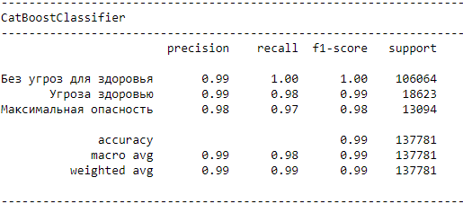

# Task 1: Визуализация

Исходя из результатов корреляции Пирсона большее влияние на определение уровня опасности оказывает адресс (атрибут address)

# Task 2: Выбор модели классификации

Модели для выбора я подобрал разной сложности:

1. LogisticRegression
2. RandomForestClassifier
3. CatBoostClassifier

 
Чтобы выбрать модель я буду использовать метрики:

1. F1-score
2. precision
3. recall
4. accurasy

 

Исходя из выбранных метрик лучше всего себя показала модель CatBoostClassifier для задачи определения уровня опасности дорожной ситуации относительно других моделей.

Описание показателей CatBoostClassifier:

F1-score - почти сто процетное определение классов: Угроза здоровью, Максимальная опасность и сто процетное определение класса Без угроз для здоровья.

Для метрик precision и recall примерно одинаковое хорошее соотношение угадывания в сторону positive и negative. 

accurasy - точность ~99%.

# Task 3: Feature Engineering

Для увеличения точности определения кластера я подобрал параметры модели так чтобы увеличить точность модели

# Task 4: Визуализация по географическим признакам

### Что в Data.zip?

1. dataset.csv - все данные + кластер
2. dataframe.csv - все данные
3. labeling.pkl - словарь содержащий кодер и декодер некоторых фич
4. train_df.csv - выборка для обучения
5. test_df.csv - выборка для тестирования
6. model_cbc - обученная модель классификации